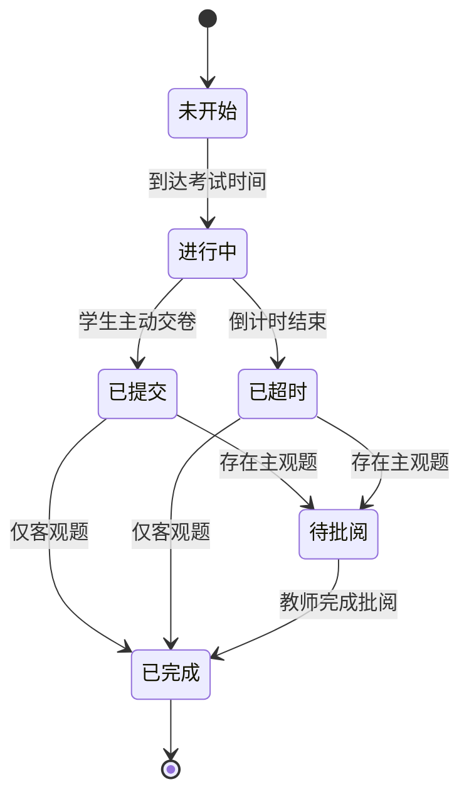
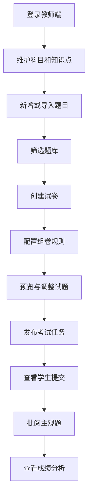
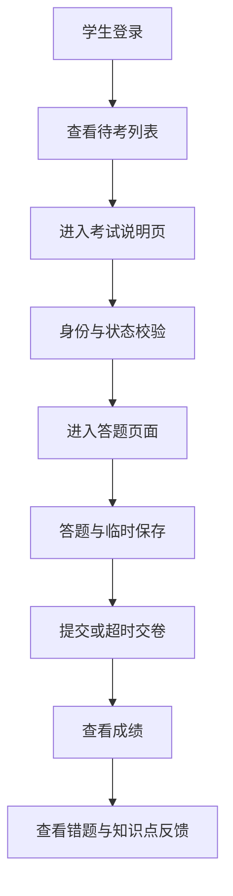
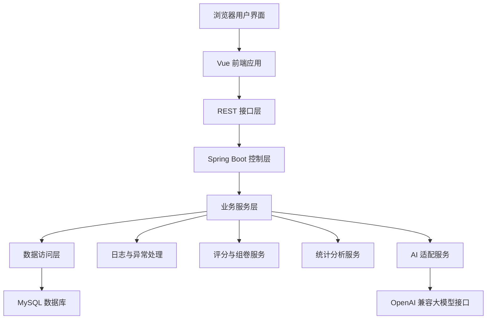

# 第七组在线考试系统项目主控文档

> 本文档是第七组“在线考试系统”后续开发、测试、答辩展示与实训报告撰写的唯一主线文档。后续每推进一个阶段，都应先确认本阶段范围，再实施，再验证，再把验证结果、截图、问题与可写入报告的文字同步补充回本文档，避免项目方向偏移和上下文遗失。

---

## 0. 文档使用规则

### 0.1 主控原则

1. 课程文档优先于个人发挥：系统功能、报告结构、交付物、格式要求均以当前目录课程资料为最高依据。
2. 小步快跑：每次只推进一个可独立完成、可独立验证、可独立记录的阶段。
3. 完成即验证：每完成一个功能或阶段，必须有可复现的页面、接口、数据库或文档验证结果。
4. 验证即记录：验证通过后，立即在本文档的阶段进度记录中写明完成内容、截图位置、测试结果、问题与修复。
5. 记录即可写论文：每阶段完成后，都沉淀一段可以直接改写进实训报告的文字。
6. 不抄袭：往届报告与外部链接只用于学习结构、表达深度、常见功能和工程组织方式，不能照搬文字、截图、代码或数据库设计。
7. 非重大阻塞自动推进：某一阶段完成并验证通过后，不需要停下来等待用户再下达下一阶段启动指令，应直接进入下一阶段；只有遇到范围冲突、破坏性改动、凭据密钥、无法自行判断的关键技术选型或会明显影响最终交付质量的重大问题时，才暂停并向用户确认。

### 0.2 文档更新位置

后续阶段完成后，优先更新以下章节：

- “20. 阶段进度记录模板与当前记录”
- “14. 小步快跑阶段路线图”中对应阶段的完成状态
- “16. 实训报告同步沉淀规划”中对应章节素材
- “17. GitHub 仓库初始化与演进策略”中对应仓库状态

---

## 1. 当前目录资料逐一识别与用途分析

当前工作目录中与项目规划直接相关的课程资料共六个，另外还有一张在线考试系统后台演示图。用户说明的“六个文件”指分组表、撰写规范、教学大纲、题目及要求、任务书及报告模板、往届报告样本；[`image.png`](image.png)属于额外优秀后台界面参考材料，不改变课程约束优先级。

| 序号 | 文件 | 类型 | 主要用途 | 可直接用于本项目的信息 | 使用约束 |
|---|---|---|---|---|---|
| 1 | [`《计算机工程综合能力实训》分组表.xlsx`](《计算机工程综合能力实训》分组表.xlsx) | 表格 | 确认分组、题目、组员 | 第七组，题目为在线考试系统；组长陈绍杰，成员张嘉豪、黄权达、黄浩然 | 作为组员与题目事实来源，优先用于任务书封面与分工表 |
| 2 | [`2、课程设计（论文）撰写规范.docx`](2、课程设计（论文）撰写规范.docx) | Word 规范 | 论文版式和写作规范 | A4、页眉页码、页边距、行距、摘要、目录、图表公式、参考文献、附录、致谢要求 | 主要约束报告格式，不决定系统功能 |
| 3 | [`S3039I_《计算机工程综合能力实训》教学大纲.docx`](S3039I_《计算机工程综合能力实训》教学大纲.docx) | Word 大纲 | 课程目标、进度、考核、成果要求 | 课程为 3 学分、15 天集中实践；要求完成项目管理、需求分析、概要设计、详细设计、实现、优化、测试、报告；评分含需求、设计、实现、测试、报告、个人贡献 | 当与任务书或题目及要求冲突时让位于任务书与题目及要求 |
| 4 | [`S3039I_《计算机工程综合能力实训》题目及要求.docx`](S3039I_《计算机工程综合能力实训》题目及要求.docx) | Word 题目要求 | 选题列表、在线考试系统项目简介、功能要求、提交材料 | 在线考试系统需支持在线组卷、智能监考、自动评分；学生、教师、管理员三类模块；题库、组卷、批阅、考试分析、日志、防作弊 | 与本题功能边界最直接相关，应重点遵守 |
| 5 | [`S3039I-《计算机工程综合能力实训》任务书及报告模板.docx`](S3039I-《计算机工程综合能力实训》任务书及报告模板.docx) | Word 模板 | 任务书、实训报告章节、评分表、格式提示 | 报告章节应覆盖问题描述与需求分析、总体设计、详细设计、编码实现与测试、总结与展望、参考文献、致谢；任务书需写题目、组员、分工、进度；提交源代码压缩包 | 章节结构和提交组织的核心依据；模板中的示例班级、姓名、日期为占位内容 |
| 6 | [`参考资料-学生宿舍管理系统课程设计报告样本.pdf`](参考资料-学生宿舍管理系统课程设计报告样本.pdf) | PDF 样本 | 学习报告结构、深度、图表表达 | 可参考需求概述、系统边界、业务需求、功能需求、数据需求、业务规则、E-R 图、逻辑结构、物理结构、数据库实施、安全性、系统实现、结论等写法 | 仅可作为结构、深度和表达方式参考，不能照搬内容 |
| 7 | [`image.png`](image.png) | 图片 | 在线考试系统后台界面设计参考 | 参考菜单包括首页、系统管理、系统监控、系统功能、校园资讯、科目管理、用户管理、角色管理、教师管理、菜单管理、知识点管理、系统参数、学习资料、题库管理、试卷管理、考试任务、班级管理、阅卷管理、成绩分析；题库列表支持关键词、题型、难度、科目、状态筛选以及新增、批量删除、编辑、撤回、删除 | 只作为 UI、模块覆盖面与后台交互体验参考，不作为课程约束来源 |

---

## 2. 文档优先级、冲突记录与处理依据

### 2.1 本项目采用的优先级

按用户要求，后续所有输出和实现遵循以下优先级：

1. [`S3039I-《计算机工程综合能力实训》任务书及报告模板.docx`](S3039I-《计算机工程综合能力实训》任务书及报告模板.docx) 与 [`S3039I_《计算机工程综合能力实训》题目及要求.docx`](S3039I_《计算机工程综合能力实训》题目及要求.docx)
2. [`S3039I_《计算机工程综合能力实训》教学大纲.docx`](S3039I_《计算机工程综合能力实训》教学大纲.docx)
3. [`2、课程设计（论文）撰写规范.docx`](2、课程设计（论文）撰写规范.docx)
4. 报告模板中的示例内容
5. [`参考资料-学生宿舍管理系统课程设计报告样本.pdf`](参考资料-学生宿舍管理系统课程设计报告样本.pdf)
6. 外部文章链接与 [`image.png`](image.png) 界面参考

### 2.2 已发现冲突与处理方案

| 冲突点 | 涉及来源 | 表现 | 处理方案 |
|---|---|---|---|
| 提交材料范围不同 | 题目及要求、教学大纲、任务书模板 | 题目及要求与教学大纲要求任务书、实训报告、系统源代码、演示视频等；任务书模板强调实训报告和源代码压缩包 | 采用更稳妥的并集：准备实训报告含任务书、系统源代码、开发说明或源代码简介、运行说明、数据库脚本、演示视频、必要截图，压缩包按老师最终通知命名 |
| 压缩包命名规则不同 | 题目及要求、教学大纲、任务书模板 | 有的要求“组号-《题目名称》-学号尾数2位 姓名”，有的要求“组号-《题目名称》” | 先在仓库和本地按“第7组-《在线考试系统》”组织；最终提交前按指导教师通知补充姓名或尾号 |
| 班级信息不同 | 分组表、任务书模板 | 分组表为 23 本科计科 1 班；模板示例为 23 本科计科创新 3 班 | 模板班级为占位示例，正式报告使用分组表与老师通知中的真实班级信息 |
| 技术栈表述不同 | 教学大纲、题目及要求、题目列表中其他课题 | 在线考试题目允许前端 HTML/CSS/JavaScript，后端 Python/Java/C++/PHP/NodeJS 任选，数据库任选；教学大纲先修课和参考书偏 Java、JavaEE、Spring Boot | 选择 Java Spring Boot + MySQL + Vue 前后端分离，既符合“任选”也贴合先修课程和课程参考书，且便于报告书写与答辩演示 |
| 报告章节标题不同 | 撰写规范、任务书模板、PDF 样本 | 撰写规范给出通用论文顺序，模板给出第1章到第5章结构，PDF 样本章节偏数据库系统课程 | 以任务书模板章节为主，撰写规范控制格式，PDF 样本只参考深度和图表表达 |
| 外部链接无法作为硬约束 | 用户提供链接、当前工具能力 | 当前工具环境已读取本地文件和图片，但没有直接网页抓取工具 | 把链接作为待人工核验参考源，先吸收在线考试系统常见工程思路；正式报告引用前由组员打开链接核对作者、题名、时间并按参考文献格式列出 |

### 2.3 当前稳妥假设

1. 项目题目固定为“在线考试系统”，不再更换。
2. 系统定位为 Web 信息系统类项目，不做单片机或小程序方向。
3. 老师允许自主选择技术栈，应用技术列表为参考，不作强制限制。
4. 实训报告最终需要 Word 和 PDF 版本，源代码需要压缩包，演示视频作为高稳妥交付物准备。
5. 由于本科实训周期有限，不做真实摄像头监考、人脸识别、复杂自然语言评分、真实大规模并发压测等高风险功能；采用可实现、可展示、可说明的轻量化智能组卷、防作弊记录、错题反馈、统计分析。

---

## 3. 课程约束总结

### 3.1 项目目标约束

课程要求学生通过完整项目实践掌握企业级软件系统开发流程，覆盖：

- 可行性研究与项目开发计划
- 需求分析
- 概要设计
- 详细设计
- 系统实现
- 系统优化
- 系统测试
- 实训报告与总结

在线考试系统必须体现对现实教育考核场景的分析、抽象、设计、实现与验证，不能只做静态页面或简单增删改查。

### 3.2 选题功能边界约束

根据在线考试系统题目要求，本项目至少应覆盖以下边界：

| 角色 | 必须体现的功能 |
|---|---|
| 学生 | 身份认证、待考与历史考试查看、进入限时考试界面、临时答案保存、成绩和排名查看 |
| 教师 | 单选、多选、填空、主观题等题型管理；从题库组卷；客观题自动评分；主观题在线批注 |
| 管理员 | 教师和学生权限管理；成绩分布图；题目正确率统计；系统操作日志；考试异常事件；防作弊机制，包括切屏检测和答案相似度分析 |

### 3.3 报告格式约束

报告应遵循：

- A4 双面打印要求。
- 正文小四号字，1.5 倍行距。
- 页眉从正文开始，页眉为论文名称。
- 顺序依次包含封面、中文摘要、英文摘要、目录、正文、参考文献、致谢，主要符号表和附录按需列入。
- 中文摘要约 200 到 400 字，关键词 3 到 5 个。
- 英文摘要与中文摘要内容一致。
- 图按章编号，如图 1-1；图注置于图下方。
- 表按章编号，如表 2-1；表题置于表格上方。
- 参考文献不少于 5 篇，且应包含外文文献；正式引用需按出现顺序编号。

### 3.4 报告章节约束

任务书模板建议结构如下，后续报告建议沿用并细化：

1. 第1章 问题描述与需求分析
   - 选题背景与意义
   - 功能需求分析
   - 性能需求分析
   - 开发环境与工具
2. 第2章 总体设计
   - 架构设计
   - 类设计或模块设计
   - 数据设计
3. 第3章 详细设计
   - 核心模块交互设计
   - 关键流程、接口、数据库、页面设计
4. 第4章 编码实现与测试
   - 核心代码实现
   - 测试方案设计
   - 测试结果与分析
   - 性能验证
   - 问题与修复
5. 第5章 总结与展望
   - 课程设计总结
   - 不足与改进方向
   - 未来拓展展望
6. 参考文献
7. 致谢

### 3.5 考核要求约束

评分结构强调团队成果与个人贡献：

| 考核项 | 关注重点 | 本项目应对策略 |
|---|---|---|
| 需求分析 | 需求完整、分解、排序、核心功能与非功能需求识别 | 写清角色、业务流程、系统边界、功能需求、非功能需求、数据需求 |
| 系统设计 | 架构理解、组件交互、技术选型合理 | 提供前后端分层架构、数据库设计、状态流转、接口设计原则 |
| 系统实现 | 代码整洁、结构清晰、遵循规范、功能完成 | 采用模块化目录、统一响应、统一异常、业务代码注释、分阶段验证 |
| 系统测试 | 测试计划、测试用例、执行记录、结果分析 | 每阶段沉淀测试用例，最终形成系统测试章节 |
| 报告总结 | 文档质量、系统展示、经验教训 | 开发同步记录，避免最后集中补文档导致遗漏 |
| 个人贡献 | 核心任务、质量、协作 | 每位成员绑定清晰模块，提交记录和文档记录可追踪 |

### 3.6 课程时间节奏约束

课程资料规定集中实践总量为 15 天，并给出基础知识、系统分析、系统设计、系统实现、系统优化、实训报告等阶段。本文档后续阶段路线不自行估算耗时，只按“阶段目标、完成标准、验证方法”推进。

---

## 4. 第七组基本信息与建议分工

| 角色 | 学号 | 姓名 | 建议负责方向 | 说明 |
|---|---|---|---|---|
| 组长 | 2312402060134 | 陈绍杰 | 项目统筹、总体架构、考试状态流转、报告整合 | 负责组织分工、把控范围、推进验收 |
| 成员 | 2312402060135 | 张嘉豪 | 前端页面、教师端后台、数据可视化 | 重点保障界面现代化和演示效果 |
| 成员 | 2312402060133 | 黄权达 | 后端题库、试卷、评分、数据库设计 | 重点保障核心业务逻辑与数据一致性 |
| 成员 | 2312402060128 | 黄浩然 | 学生端考试、测试验证、演示视频、文档素材 | 重点保障考试体验、测试记录和答辩素材 |

> 分工可根据成员实际能力调整，但报告中的任务分配表应保证每位成员都有明确且可验证的贡献。

---

## 5. 推荐项目方向

### 5.1 推荐名称

智慧在线考试与学习反馈系统

### 5.2 项目定位

本项目面向高校课程考核、课堂测验和阶段训练场景，设计并实现一个基于 Web 的在线考试系统。系统以题库、试卷、考试任务、在线作答、自动判分、主观题批阅、成绩分析、防作弊记录和错题反馈为核心，服务管理员、教师和学生三类用户。项目既满足课程文档中“在线组卷、智能监考、自动评分、数据分析”的要求，又控制功能范围，避免过度扩张。

### 5.3 核心目标

1. 建立完整的在线考试业务闭环：建题、组卷、发布考试、学生答题、提交、判分、批阅、查成绩、看分析。
2. 建立清晰的角色权限体系：管理员维护基础数据和权限，教师负责题库与考试，学生参与考试与查看反馈。
3. 建立可展示的创新表达：规则组卷、防作弊事件记录、答案相似度提示、错题本、知识点掌握分析、可视化成绩报表。
4. 建立可写入报告的工程化过程：需求分析、架构设计、数据库设计、详细流程、实现截图、测试用例、问题修复均可同步沉淀。
5. 建立可维护的仓库与文档体系：逐步完善项目简介、运行说明、数据库脚本、版本记录、演示截图和报告素材。

### 5.4 不做或后置的内容

为保证实训可落地，以下内容不作为核心交付：

- 不做真实支付、商业化运营。
- 不做摄像头实时监考、人脸识别、屏幕录制等隐私和实现风险较高功能。
- 不做复杂自然语言智能评分，只做主观题关键词评分提示或教师辅助批阅。
- 不做真实高并发考试平台，只做基础性能验证和本地部署演示。
- 不做复杂微服务架构，避免部署和调试成本过高。

---

## 6. 推荐技术栈与选择理由

### 6.1 总体技术方案

| 层次 | 推荐技术 | 选择理由 |
|---|---|---|
| 前端 | Vue 3、Vite、TypeScript、Element Plus、ECharts | 与后台演示图风格匹配，组件丰富，页面现代化，适合快速搭建教师端和管理端，图表展示效果好 |
| 后端 | Java、Spring Boot 3、Spring Security 或 Sa Token、MyBatis Plus | 符合课程先修 Java 和 JavaEE，工程结构清晰，权限、接口、数据库开发效率高，报告可写性强 |
| 数据库 | MySQL 8 | 课程常见数据库，部署简单，适合关系型考试数据建模，便于写 E-R 图和物理表设计 |
| 接口 | REST 风格 JSON 接口 | 前后端分离清晰，便于测试和截图记录 |
| AI 接入 | OpenAI 兼容接口适配层、可配置 Base URL、模型名、API Key、超时与重试策略 | 能接入 OpenAI、通义千问兼容接口、DeepSeek 等兼容服务或本地兼容网关，便于实现 AI 辅助出题、解析生成、学习反馈和主观题评分建议 |
| 图表 | ECharts | 成绩分布、题目正确率、知识点掌握度展示直观，答辩效果好 |
| 构建与协作 | Git、GitHub、分支协作、提交记录 | 满足团队协作和过程留痕，便于展示项目推进过程 |
| 部署 | 本地开发环境优先，后期可选 Docker Compose | 先保证可运行可演示，后期再补充部署说明和可选容器化 |

### 6.2 为什么不建议选择更复杂方案

| 备选方案 | 不优先原因 |
|---|---|
| 微服务架构 | 对本科实训而言复杂度过高，部署链路长，不利于按阶段快速完成和验证 |
| 纯静态页面加本地存储 | 无法体现数据库设计、权限控制、接口设计和真实工程流程 |
| 低代码或模板全套套用 | 容易被认为缺少独立设计和实现，报告也难体现个人工作量 |
| 完全依赖人工智能自动评分 | 准确性、可解释性和责任边界较难保证，不适合作为成绩唯一依据；本项目仅采用“AI 评分建议 + 教师确认”的稳妥方式 |
| 摄像头监考 | 涉及权限、隐私、浏览器兼容与硬件，不适合作为稳妥主线 |

### 6.3 技术栈与课程要求的对应关系

- 课程要求使用现代工具和主流技术：Spring Boot、Vue、MySQL 均满足。
- 课程要求完整系统开发流程：该技术栈适合清晰展示前端、后端、数据库、测试和部署。
- 课程要求团队协作：前后端分离便于成员分工。
- 课程要求报告图文并茂：该技术栈便于提供架构图、接口表、数据库表、页面截图、测试截图。
- 课程要求创新性：ECharts、规则组卷、防作弊日志、错题分析和 AI 辅助能力均能形成可展示亮点。

### 6.4 OpenAI 兼容接口接入理由

引入 OpenAI 兼容接口不是为了把项目做成不可控的“AI 自动考试平台”，而是把大模型作为可配置、可关闭、可审计的辅助能力。这样既能体现当前人工智能发展趋势，也能避免功能范围过度膨胀。

1. 开发效率：采用统一的 OpenAI 兼容协议后，后端只需实现一套适配层，即可切换不同兼容模型服务。
2. 学习成本：团队只需要理解聊天补全请求、模型配置、提示词模板和响应解析，不必深入训练模型。
3. 演示效果：教师端可展示 AI 辅助生成题目、生成解析、主观题评分建议；学生端可展示个性化错题讲解和学习建议。
4. 部署难度：AI 能力默认作为可选模块，未配置 API Key 时系统仍可完成核心考试闭环；演示时可使用真实服务或模拟响应。
5. 团队协作：AI 模块可独立开发，不阻塞题库、组卷、考试、评分等主线功能。
6. 论文可写性：可在详细设计中说明 AI 适配层、提示词模板、人工复核机制、数据安全与风险控制，体现创新意识和工程规范。

---

## 7. 系统创新点设计

### 7.1 规则化智能组卷

教师创建试卷时，可以按科目、知识点、题型、难度、题量、分值等条件配置组卷规则。系统从题库中自动抽题并生成试卷草稿，教师可再手动调整。

可展示价值：

- 比单纯手动选题更智能。
- 便于解释算法逻辑。
- 数据库和报告中可写清楚规则、流程和异常处理。

### 7.2 考试状态流转

考试任务和学生考试记录采用状态化设计，例如未开始、进行中、已提交、已超时、待批阅、已完成。系统在页面和接口层统一依据状态限制操作。

可展示价值：

- 体现工程设计能力。
- 避免考试业务混乱。
- 可绘制状态转换图用于报告。

### 7.3 轻量防作弊机制

系统记录学生考试过程中的异常事件，例如切屏、页面失焦、退出全屏、复制粘贴、超时提交等。管理员或教师可在考试记录中查看异常次数和异常详情。

可展示价值：

- 满足题目及要求中的防作弊机制。
- 不涉及隐私敏感摄像头。
- 可用浏览器事件实现，适合本科实训。

### 7.4 答案相似度提示

考试结束后，系统可对同一试卷中学生的客观题答案序列和主观题文本做简单相似度计算，超过阈值时生成提示记录。该记录只作为教师复核参考，不直接判定作弊。

可展示价值：

- 呼应题目要求中的答案相似度分析。
- 算法可解释，便于写详细设计。
- 风险可控，不会过度复杂。

### 7.5 错题本与学习反馈

学生查看成绩时，不只看到总分，还能看到错题、正确答案、解析和薄弱知识点统计。系统可生成个人知识点掌握雷达图或柱状图。

可展示价值：

- 在线考试不止完成考核，还能支持学习改进。
- 适合答辩展示学生端体验。
- 可写入总结展望和创新点章节。

### 7.6 可视化成绩分析

教师和管理员端提供成绩分布、班级平均分、及格率、题目正确率、知识点错误率等图表。

可展示价值：

- 展示效果好。
- 与课程要求的数据采集、整理、分析相匹配。
- 可为测试和报告提供图文素材。

### 7.7 OpenAI 兼容 AI 辅助模块

系统预留 OpenAI 兼容接口适配层，通过统一配置 Base URL、模型名称、API Key、温度参数、超时时间和提示词模板，支持接入不同大模型服务。AI 模块定位为“辅助教师、辅助学生、辅助报告记录”，不直接替代教师最终判断。

建议优先实现以下可落地功能：

| AI 功能 | 使用角色 | 具体表现 | 人工控制边界 |
|---|---|---|---|
| AI 辅助出题 | 教师 | 根据科目、知识点、题型、难度、数量生成题目草稿 | 生成结果必须进入草稿状态，由教师编辑确认后才可发布 |
| AI 题目解析生成 | 教师 | 为已有题目生成参考解析、易错点说明 | 教师可修改，学生端只展示教师确认后的解析 |
| AI 主观题评分建议 | 教师 | 根据评分标准、学生答案和参考答案给出建议分与评语 | 只作为批阅参考，最终分数由教师提交 |
| AI 错题讲解 | 学生 | 对错题生成更通俗的讲解、相关知识点提示 | 只在成绩发布后开放，不能在考试中使用 |
| AI 学习建议 | 学生 | 根据知识点错误率生成复习建议 | 建议不影响成绩，仅作为学习反馈 |
| AI 报告素材辅助 | 团队成员 | 根据阶段记录生成报告段落草稿 | 必须人工核对课程规范和事实，不能直接照搬 |

可展示价值：

- 与“人工智能赋能编程和教育信息化”的趋势相结合，创新点更贴合当前技术发展。
- OpenAI 兼容接口可解释、可配置、可演示，适合本科实训层面实现。
- 通过“AI 生成草稿 + 人工确认 + 日志留痕”的方式控制准确性和责任边界。
- 后续报告可以围绕 AI 接入架构、提示词模板、安全约束、人工复核机制进行论述。

---

## 8. 系统角色与业务流程

### 8.1 角色划分

| 角色 | 核心职责 | 主要页面 |
|---|---|---|
| 管理员 | 用户、角色、班级、科目、公告、系统参数、日志、全局统计 | 管理后台、用户管理、角色管理、班级管理、科目管理、公告管理、系统日志、成绩分析 |
| 教师 | 维护知识点与题库，组卷，发布考试，阅卷，查看分析 | 教师工作台、知识点管理、题库管理、试卷管理、考试任务、阅卷管理、成绩分析 |
| 学生 | 查看考试任务，在线答题，提交，查成绩，看错题与学习反馈 | 学生首页、考试中心、考试作答页、成绩查询、错题本、公告 |

### 8.2 总体业务闭环


### 8.3 考试状态流转



### 8.4 教师端核心流程



### 8.5 学生端核心流程



---

## 9. 功能模块拆解

### 9.1 管理员端模块

| 模块 | 子功能 | 优先级 | 说明 |
|---|---|---|---|
| 登录与权限 | 登录、退出、角色菜单控制 | 核心 | 所有后续模块的前置基础 |
| 用户管理 | 管理学生、教师、管理员账号；启用禁用；重置密码 | 核心 | 满足权限管理要求 |
| 角色管理 | 配置管理员、教师、学生角色 | 核心 | 可先做固定角色，后续扩展菜单权限 |
| 班级管理 | 班级增删改查、学生归属班级 | 核心 | 关联考试任务发布和成绩统计 |
| 科目管理 | 科目增删改查 | 核心 | 题库和试卷的基础数据 |
| 公告管理 | 发布考试通知或系统公告 | 可展示 | 增强系统完整性 |
| 系统日志 | 操作日志、登录日志、异常事件查询 | 核心 | 满足系统日志要求 |
| 全局分析 | 成绩分布、题目正确率、考试参与率 | 核心 | 满足考试分析要求 |

### 9.2 教师端模块

| 模块 | 子功能 | 优先级 | 说明 |
|---|---|---|---|
| 教师工作台 | 待批阅数量、近期考试、题库统计 | 可展示 | 提升演示效果 |
| 知识点管理 | 按科目维护知识点树或列表 | 核心 | 支撑组卷和错题分析 |
| 题库管理 | 单选、多选、判断、填空、主观题管理；题目状态；难度；解析 | 核心 | 与 [`image.png`](image.png) 高度匹配 |
| 试卷管理 | 手动组卷、规则组卷、试卷预览、分值设置 | 核心 | 系统核心亮点 |
| 考试任务 | 发布考试、设置时间、班级、限时、防作弊规则 | 核心 | 连接教师和学生 |
| 阅卷管理 | 主观题批阅、批注、关键词提示、成绩修正 | 核心 | 满足主观题在线批注 |
| 成绩分析 | 班级成绩、题目正确率、知识点薄弱项 | 核心 | 支撑报告和答辩 |

### 9.3 学生端模块

| 模块 | 子功能 | 优先级 | 说明 |
|---|---|---|---|
| 学生首页 | 待考提醒、公告、最近成绩 | 可展示 | 提升体验 |
| 考试中心 | 待考、进行中、历史考试 | 核心 | 满足学生模块要求 |
| 在线答题 | 倒计时、题目导航、答案暂存、交卷确认 | 核心 | 系统演示重点 |
| 防作弊记录 | 切屏提醒、异常次数提示 | 核心 | 学生端交互体现 |
| 成绩查询 | 总分、排名、答题详情 | 核心 | 满足成绩查询要求 |
| 错题本 | 错题列表、解析、知识点归类 | 创新 | 体现学习反馈 |

---

## 10. 数据库核心实体设计

### 10.1 核心实体清单

| 实体 | 用途 | 核心字段建议 | 关系说明 |
|---|---|---|---|
| 用户 user | 存储登录账号基础信息 | 用户编号、账号、密码摘要、姓名、手机号、邮箱、状态、创建时间 | 与角色、学生档案、教师档案关联 |
| 角色 role | 权限角色 | 角色编号、角色编码、角色名称、状态 | 管理员、教师、学生 |
| 用户角色 user_role | 多角色关联 | 用户编号、角色编号 | 支持扩展权限 |
| 班级 class | 学生组织 | 班级编号、班级名称、专业、年级、状态 | 学生属于班级，考试任务可发布到班级 |
| 学生档案 student_profile | 学生信息 | 用户编号、学号、班级编号、姓名 | 关联考试参与记录 |
| 教师档案 teacher_profile | 教师信息 | 用户编号、工号、职称或简介 | 关联题目、试卷、考试任务 |
| 科目 subject | 考试科目 | 科目编号、科目名称、描述、状态 | 题目和试卷归属科目 |
| 知识点 knowledge_point | 题目知识点 | 知识点编号、科目编号、名称、父级编号、排序 | 用于组卷和错题分析 |
| 题目 question | 题库主体 | 题目编号、科目编号、知识点编号、题型、难度、题干、解析、分值、状态、创建人 | 与选项、试卷题目关联 |
| 题目选项 question_option | 客观题选项 | 选项编号、题目编号、选项标识、选项内容、是否正确 | 单选、多选、判断可复用 |
| 试卷 paper | 试卷主体 | 试卷编号、科目编号、名称、总分、状态、创建人 | 与试卷题目关联 |
| 试卷题目 paper_question | 试卷与题目关系 | 试卷编号、题目编号、题序、分值 | 支持一题多卷 |
| 考试任务 exam_task | 发布考试 | 任务编号、试卷编号、班级编号、开始时间、结束时间、限时、状态、防作弊配置 | 学生看到的考试来源 |
| 考试参与 exam_participant | 学生考试资格 | 任务编号、学生编号、参与状态 | 可用于批量生成待考名单 |
| 考试记录 exam_attempt | 一次考试过程 | 记录编号、任务编号、学生编号、开始时间、提交时间、状态、客观分、主观分、总分 | 答题、评分、异常事件都归属该记录 |
| 答案记录 answer_record | 学生每题作答 | 记录编号、考试记录编号、题目编号、答案内容、得分、是否正确、批阅状态 | 支撑自动评分与主观批阅 |
| 批阅记录 review_record | 主观题批阅 | 批阅编号、答案编号、教师编号、批注、得分、批阅时间 | 满足在线批注 |
| 异常事件 cheat_event | 防作弊日志 | 事件编号、考试记录编号、事件类型、事件时间、详情 | 记录切屏、失焦、粘贴、超时等 |
| 错题本 wrong_question | 学习反馈 | 学生编号、题目编号、考试记录编号、错误次数、最近错误时间 | 支撑错题分析 |
| 公告 notice | 通知公告 | 公告编号、标题、内容、发布人、状态、发布时间 | 增强系统完整性 |
| 操作日志 operation_log | 系统操作留痕 | 日志编号、用户编号、操作模块、操作类型、请求结果、时间 | 满足日志要求 |
| AI 提供方配置 ai_provider_config | 存储 OpenAI 兼容服务配置 | 配置编号、名称、Base URL、模型名、启用状态、超时、创建人 | API Key 不建议明文入库，可使用环境变量或加密存储 |
| AI 提示词模板 ai_prompt_template | 管理不同 AI 场景提示词 | 模板编号、场景编码、模板内容、版本、状态、创建人 | 支撑出题、解析、评分建议、学习建议等场景 |
| AI 调用日志 ai_usage_log | 记录 AI 调用过程 | 日志编号、用户编号、场景、模型、请求摘要、响应摘要、耗时、结果状态、时间 | 便于审计、排查和报告截图 |
| AI 评分建议 ai_review_suggestion | 存储主观题 AI 批阅建议 | 建议编号、答案编号、建议分、建议评语、置信说明、教师采纳状态 | 只作为教师批阅参考，不直接决定成绩 |

### 10.2 核心关系示意

```mermaid
erDiagram
USER ||--o{ USER_ROLE : has
ROLE ||--o{ USER_ROLE : includes
USER ||--o| STUDENT_PROFILE : owns
USER ||--o| TEACHER_PROFILE : owns
CLASS ||--o{ STUDENT_PROFILE : contains
SUBJECT ||--o{ KNOWLEDGE_POINT : contains
SUBJECT ||--o{ QUESTION : owns
KNOWLEDGE_POINT ||--o{ QUESTION : tags
QUESTION ||--o{ QUESTION_OPTION : has
SUBJECT ||--o{ PAPER : owns
PAPER ||--o{ PAPER_QUESTION : includes
QUESTION ||--o{ PAPER_QUESTION : selected
PAPER ||--o{ EXAM_TASK : publishes
CLASS ||--o{ EXAM_TASK : targets
EXAM_TASK ||--o{ EXAM_ATTEMPT : generates
STUDENT_PROFILE ||--o{ EXAM_ATTEMPT : submits
EXAM_ATTEMPT ||--o{ ANSWER_RECORD : contains
ANSWER_RECORD ||--o{ REVIEW_RECORD : reviewed
EXAM_ATTEMPT ||--o{ CHEAT_EVENT : records
STUDENT_PROFILE ||--o{ WRONG_QUESTION : owns
QUESTION ||--o{ WRONG_QUESTION : appears
USER ||--o{ AI_USAGE_LOG : requests
AI_PROVIDER_CONFIG ||--o{ AI_USAGE_LOG : uses
AI_PROMPT_TEMPLATE ||--o{ AI_USAGE_LOG : applies
ANSWER_RECORD ||--o{ AI_REVIEW_SUGGESTION : suggests
```

### 10.3 数据库设计原则

1. 字段命名统一，避免中英文混杂。
2. 核心表都保留创建时间、更新时间、逻辑删除或状态字段。
3. 业务状态使用枚举字段，页面展示时转换为中文。
4. 客观题正确答案不直接下发给学生考试页面，避免前端泄露答案。
5. 试卷题目分值存在试卷题目表中，不完全依赖题库默认分值。
6. 学生答案按题保存，便于自动保存、断点恢复和逐题判分。
7. 异常事件独立建表，避免污染答题记录。
8. 日志表与业务表分离，方便审计和排查。
9. AI API Key 不直接返回前端，不在截图和报告中暴露。
10. AI 调用应记录场景、模型、耗时、结果状态和摘要，但避免存储过多敏感原文。
11. AI 生成题目默认保存为草稿，必须经教师确认后才能进入题库发布状态。
12. AI 评分建议与教师批阅结果分表记录，避免混淆“建议分”和“最终分”。

---

## 11. 页面结构规划与 UI 设计方向

### 11.1 后台演示图可借鉴点

[`image.png`](image.png) 展示的后台界面具有以下可借鉴点：

1. 左侧多级菜单清晰，在线考试模块下功能完整。
2. 顶部标签页支持多页面切换，适合管理端使用。
3. 题库管理页面筛选条件完整，包括题目关键词、题型、难度、科目、状态。
4. 表格信息展示规范，包括编号、题目、题型、难度、状态、创建人、创建时间、操作。
5. 操作按钮明确，包括新增题目、批量删除、编辑、撤回、删除。
6. 状态和难度用彩色标签展示，利于视觉识别。

### 11.2 管理端菜单建议

| 一级菜单 | 二级菜单 | 说明 |
|---|---|---|
| 仪表盘 | 首页 | 总览用户数、题目数、考试数、待批阅数、成绩分布 |
| 系统管理 | 用户管理、角色管理、菜单管理 | 可先做用户和角色，菜单管理可后置 |
| 基础资料 | 班级管理、科目管理、公告管理 | 支撑考试发布与系统通知 |
| 在线考试 | 知识点管理、题库管理、试卷管理、考试任务、阅卷管理、成绩分析 | 核心业务模块 |
| AI 辅助 | AI 配置、提示词模板、AI 出题、AI 调用日志 | 作为后期创新模块，支持 OpenAI 兼容服务接入 |
| 系统监控 | 操作日志、异常事件 | 支撑日志与防作弊 |
| 学习支持 | 学习资料、错题统计 | 可作为扩展亮点 |

### 11.3 教师端页面建议

| 页面 | 关键交互 |
|---|---|
| 教师工作台 | 展示题库数量、试卷数量、待批阅考试、近期考试 |
| 题库管理 | 多条件筛选、题目列表、新增题目、编辑、撤回、删除、批量操作 |
| 题目表单 | 根据题型动态展示选项、答案、解析、知识点、难度、分值 |
| AI 辅助出题 | 根据科目、知识点、题型、难度、数量生成题目草稿，教师确认后入库 |
| 试卷管理 | 试卷列表、创建试卷、预览试卷、复制试卷 |
| 组卷页面 | 手动选题或规则组卷，显示总题量与总分校验 |
| 考试任务 | 选择试卷、班级、考试时间、限时、防作弊配置 |
| 阅卷管理 | 按考试任务查看待批阅主观题，输入分数和批注，可查看 AI 评分建议 |
| 成绩分析 | 图表展示成绩分布、题目正确率、知识点薄弱项 |

### 11.4 学生端页面建议

| 页面 | 关键交互 |
|---|---|
| 学生首页 | 显示待考提醒、公告、最近成绩 |
| 考试中心 | 待考、进行中、历史考试分栏展示 |
| 考试说明 | 显示考试时间、限时、规则、诚信提示 |
| 答题页面 | 左侧或右侧题号导航，中间题目，顶部倒计时，自动保存提示，交卷按钮 |
| 成绩详情 | 总分、排名、客观分、主观分、题目得分、解析 |
| 错题本 | 按科目、知识点、题型筛选错题，查看解析和最近错误记录 |
| AI 学习建议 | 考试结束后根据错题和知识点薄弱项生成复习建议，考试进行中不可使用 |

### 11.5 视觉风格建议

1. 使用清爽的白底卡片、浅灰背景、蓝绿色主色，贴合教育系统风格。
2. 管理端重视信息密度，表格、筛选、弹窗表单要规范。
3. 学生端重视专注答题体验，减少干扰，倒计时和题号导航明显。
4. 关键状态使用标签颜色区分：草稿、已发布、进行中、待批阅、已完成、已撤回。
5. 图表采用柱状图、饼图、折线图或雷达图，不追求复杂但要清晰。

---

## 12. 前后端分层架构

### 12.1 总体架构



### 12.2 后端分层职责

| 层次 | 职责 |
|---|---|
| 控制层 | 接收请求、参数校验、调用业务服务、返回统一结果 |
| 服务层 | 实现题库、试卷、考试、评分、统计、AI 辅助等核心业务逻辑 |
| 数据访问层 | 封装数据库表操作和复杂查询 |
| 安全层 | 登录认证、角色校验、接口权限控制 |
| AI 适配层 | 封装 OpenAI 兼容请求、模型配置、提示词渲染、响应解析、超时降级和调用日志 |
| 通用层 | 统一响应、统一异常、分页、日志、枚举、工具类 |
| 定时或辅助任务 | 考试超时处理、统计缓存刷新、日志清理，后期可选 |

### 12.3 前端分层职责

| 层次 | 职责 |
|---|---|
| 路由层 | 按角色生成页面访问路径 |
| 页面层 | 管理端、教师端、学生端具体页面 |
| 组件层 | 表格、题目表单、试卷预览、答题卡、图表组件 |
| 接口层 | 封装后端接口请求 |
| 状态层 | 保存登录用户、角色、菜单、考试临时状态 |
| 样式层 | 统一主题、布局、标签、按钮、表单视觉 |

### 12.4 建议目录结构

后续仓库建议逐步演进为：

```text
smart-exam-system
├─ backend
│  ├─ src
│  ├─ pom.xml
│  └─ README.md
├─ frontend
│  ├─ src
│  ├─ package.json
│  └─ README.md
├─ database
│  ├─ schema.sql
│  ├─ seed.sql
│  └─ README.md
├─ docs
│  ├─ report-assets
│  ├─ api-design.md
│  ├─ database-design.md
│  ├─ ai-design.md
│  └─ test-records.md
├─ plans
│  └─ stage-records.md
├─ README.md
├─ .gitignore
├─ LICENSE
└─ 第七组-在线考试系统项目主控文档.md
```

> 当前先保存本文档，后续进入代码实现阶段再逐步创建目录和文件，不一次性做满。

---

## 13. 接口设计原则

### 13.1 通用原则

1. 接口按业务资源分组，如认证、用户、科目、知识点、题库、试卷、考试任务、答题、阅卷、成绩、日志、AI 辅助。
2. 所有接口返回统一结构，包含成功状态、消息、数据和错误码。
3. 列表接口统一支持分页、关键词、状态、时间范围等查询条件。
4. 新增和修改接口进行参数校验，避免空题干、空选项、分值小于等于零等问题。
5. 重要操作写入操作日志，例如发布考试、撤回题目、提交试卷、批阅成绩。
6. 学生考试接口必须校验考试时间、考试资格和考试状态。
7. 学生答题页面不返回正确答案和解析，提交后或考试结束后才允许查看。
8. 防作弊事件接口只记录事实，不直接做惩罚判定。
9. AI 接口必须由后端统一调用，前端不得直接保存或传输第三方模型 API Key。
10. AI 请求必须限制场景和权限，例如学生只能在考试结束后请求错题讲解，不能在考试中调用 AI。
11. AI 输出应进入草稿、建议或参考状态，涉及题库发布、成绩评分和报告正文时必须人工确认。
12. AI 调用应设置超时、重试、失败降级和调用日志，避免模型不可用时影响核心考试流程。
13. AI 提示词模板应集中管理，避免把业务逻辑散落在页面或控制层中。

### 13.2 接口分组建议

| 分组 | 代表能力 |
|---|---|
| 认证接口 | 登录、退出、获取当前用户、刷新用户信息 |
| 用户与权限接口 | 用户分页、创建用户、启用禁用、角色列表 |
| 基础数据接口 | 班级、科目、知识点、公告管理 |
| 题库接口 | 题目分页、新增题目、编辑题目、发布撤回、删除、选项管理 |
| 试卷接口 | 试卷分页、创建试卷、添加题目、规则组卷、预览试卷、发布撤回 |
| 考试任务接口 | 创建任务、发布任务、查询待考、查询考试详情 |
| 学生答题接口 | 开始考试、保存答案、提交考试、记录异常事件 |
| 阅卷接口 | 待批阅列表、提交批阅、修改主观题得分 |
| 成绩分析接口 | 成绩列表、个人成绩详情、成绩分布、题目正确率、知识点分析 |
| 日志接口 | 操作日志、异常事件、答案相似度提示 |
| AI 辅助接口 | 模型配置检测、提示词模板、AI 出题、解析生成、评分建议、错题讲解、调用日志 |

---

## 14. 小步快跑阶段路线图

> 每个阶段都必须满足“范围明确、实现可控、验证可复现、文档可沉淀”。后续进入实现时，严格按阶段推进，不跨阶段大范围开发。

### 阶段 0：主控文档与仓库最小准备

- 阶段目标：建立项目主线，明确课程约束、系统方向、技术栈、路线图和协作规则。
- 输入：六个课程资料文件、后台演示图、GitHub 仓库地址。
- 涉及功能：无业务功能，主要是规划与文档。
- 代码范围：暂不创建业务代码。
- 数据库变化：暂不建表。
- 页面变化：暂不建页面。
- 预期输出：本文档；后续可创建 [`README.md`](README.md)、[`.gitignore`](.gitignore)、[`LICENSE`](LICENSE)。
- 完成标准：团队成员能根据本文档理解项目边界、技术路线、阶段计划和报告要求。
- 验证方法：检查本文档是否覆盖课程约束、功能模块、数据库实体、页面规划、阶段路线、仓库策略和报告同步计划。
- 常见错误点：只写概念不落地；忽视课程提交材料；未记录冲突和假设。
- 进度记录要求：记录主控文档文件名、版本、主要决策。
- 可写入报告内容：本阶段可沉淀“选题背景与意义”“开发环境与工具初步选择”“项目可行性分析”。

### 阶段 1：前后端基础骨架与数据库连通

- 阶段目标：让项目最小可运行，完成前端、后端、数据库的基础连通。
- 输入：技术栈决策、目录结构规划。
- 涉及功能：健康检查、基础布局、数据库连接测试。
- 代码范围：[`backend`](backend) 项目骨架、[`frontend`](frontend) 项目骨架、[`database`](database) 初始脚本。
- 数据库变化：创建数据库，建立用户、角色等最小基础表或先准备脚本。
- 页面变化：前端能显示登录页或基础首页框架。
- 预期输出：本地可启动的后端服务、前端服务、数据库连接成功截图。
- 完成标准：前端页面可访问，后端接口可返回健康状态，后端能连接 MySQL。
- 验证方法：访问前端首页；调用后端健康接口；查询数据库连接日志；记录截图。
- 常见错误点：端口冲突、跨域配置缺失、数据库账号密码错误、环境说明不完整。
- 进度记录要求：记录启动命令、环境版本、成功截图、遇到的问题。
- 可写入报告内容：本阶段可沉淀“开发环境与工具”“系统运行环境”“总体架构初步说明”。

### 阶段 2：登录认证与角色权限

- 阶段目标：完成管理员、教师、学生三类账号登录与基础权限隔离。
- 输入：用户与角色表设计、前端登录页面。
- 涉及功能：登录、退出、当前用户信息、按角色跳转页面、基础菜单控制。
- 代码范围：后端认证模块、用户角色模块；前端登录页、路由守卫、菜单布局。
- 数据库变化：用户表、角色表、用户角色表、学生档案表、教师档案表初版。
- 页面变化：登录页、管理员首页、教师首页、学生首页雏形。
- 预期输出：三个测试账号分别进入对应页面。
- 完成标准：不同角色不能访问不属于自己的页面；登录失败有明确提示。
- 验证方法：使用管理员、教师、学生账号分别登录；测试错误密码；测试未登录访问受限页面。
- 常见错误点：密码明文存储、角色判断只在前端做、接口未鉴权、登录状态刷新丢失。
- 进度记录要求：记录测试账号、登录截图、权限拦截图。
- 可写入报告内容：本阶段可沉淀“用户角色分析”“权限控制设计”“登录模块详细设计与实现”。

### 阶段 3：基础资料管理

- 阶段目标：完成班级、科目、知识点、公告等基础数据，为题库和考试任务打底。
- 输入：权限模块、基础表设计。
- 涉及功能：班级管理、科目管理、知识点管理、公告管理。
- 代码范围：基础资料后端接口；前端表格、筛选、表单弹窗。
- 数据库变化：班级表、科目表、知识点表、公告表。
- 页面变化：管理员或教师端基础资料菜单。
- 预期输出：可新增科目、知识点、班级和公告。
- 完成标准：基础数据可增删改查，题库页面后续可引用科目和知识点。
- 验证方法：新增一门科目，新增多个知识点，新增一个班级，发布一条公告，刷新后数据仍存在。
- 常见错误点：删除基础数据时未考虑被题目引用；知识点层级循环；空名称重复提交。
- 进度记录要求：记录基础数据截图和数据库样例。
- 可写入报告内容：本阶段可沉淀“数据需求分析”“基础数据模块设计”“部分数据字典”。

### 阶段 4：题库管理

- 阶段目标：实现题库核心功能，支持多题型、多难度、状态管理和筛选。
- 输入：科目、知识点、教师账号。
- 涉及功能：新增题目、编辑题目、删除题目、发布撤回、分页筛选、选项管理。
- 代码范围：题目后端接口、选项逻辑、题库页面、题目表单组件。
- 数据库变化：题目表、题目选项表。
- 页面变化：题库管理页面，参考 [`image.png`](image.png) 的筛选区和表格结构。
- 预期输出：教师可维护单选、多选、判断、填空、主观题。
- 完成标准：不同题型表单正确；客观题能标记正确答案；发布题目可被试卷引用。
- 验证方法：分别创建五类题目；按题型、难度、科目、状态筛选；编辑后刷新验证；撤回后不可组卷。
- 常见错误点：多选题正确答案保存格式混乱；填空题答案判定不统一；删除已被试卷引用的题目导致数据不一致。
- 进度记录要求：记录题库页面截图、题目表单截图、数据库表样例。
- 可写入报告内容：本阶段可沉淀“题库管理模块详细设计”“题目数据结构设计”“题库管理实现截图”。

### 阶段 5：试卷管理与规则组卷

- 阶段目标：实现手动组卷和规则组卷，形成可发布的试卷。
- 输入：已发布题目、科目、知识点。
- 涉及功能：创建试卷、添加题目、设置分值、预览试卷、规则组卷、发布撤回。
- 代码范围：试卷后端接口、组卷服务、试卷管理页面、试卷预览组件。
- 数据库变化：试卷表、试卷题目关联表。
- 页面变化：试卷列表、试卷编辑、规则组卷表单、试卷预览。
- 预期输出：教师能通过规则自动抽题并生成试卷。
- 完成标准：试卷总分计算正确；题目不重复；题量不足时给出提示；发布后可用于考试任务。
- 验证方法：按科目、题型、难度配置规则；验证抽题数量和总分；手动调整题目；预览试卷。
- 常见错误点：题量不足未提示；同一题重复出现；修改题库影响已发布试卷内容；总分与分值不一致。
- 进度记录要求：记录组卷规则、生成结果、异常提示截图。
- 可写入报告内容：本阶段可沉淀“组卷策略设计”“试卷管理模块实现”“规则组卷算法流程”。

### 阶段 6：考试任务发布与学生在线答题

- 阶段目标：打通教师发布考试与学生参加考试的核心链路。
- 输入：已发布试卷、班级、学生账号。
- 涉及功能：创建考试任务、发布到班级、学生待考列表、开始考试、倒计时、答案保存、提交。
- 代码范围：考试任务接口、学生答题接口、考试页面、答题卡组件、自动保存逻辑。
- 数据库变化：考试任务表、考试参与表、考试记录表、答案记录表。
- 页面变化：考试任务管理页、学生考试中心、在线答题页。
- 预期输出：学生能进入考试并提交答案，教师能看到提交记录。
- 完成标准：考试时间校验正确；倒计时可用；答案能保存；提交后不能重复提交。
- 验证方法：创建考试任务；学生登录查看待考；开始答题；刷新页面验证已保存答案；提交并查看记录。
- 常见错误点：开始时间和结束时间边界错误；刷新丢答案；重复提交；学生看到正确答案；未限制非目标班级学生。
- 进度记录要求：记录考试任务配置、学生答题页、提交成功、数据库记录。
- 可写入报告内容：本阶段可沉淀“考试流程设计”“学生答题模块详细设计”“考试状态流转实现”。

### 阶段 7：自动评分与主观题阅卷

- 阶段目标：完成客观题自动判分、主观题教师批阅和总分计算。
- 输入：学生提交记录、试卷答案、教师账号。
- 涉及功能：自动评分、主观题待批阅列表、批注、给分、成绩汇总。
- 代码范围：评分服务、阅卷接口、阅卷页面、成绩更新逻辑。
- 数据库变化：答案记录得分字段、批阅记录表、成绩字段更新。
- 页面变化：阅卷管理页面、成绩详情初版。
- 预期输出：客观题自动得分，主观题经教师批阅后形成总成绩。
- 完成标准：单选、多选、判断、填空评分正确；主观题分数不超过题目分值；批阅后状态更新。
- 验证方法：准备包含客观题和主观题的试卷；学生提交；检查自动分；教师批阅；学生查看成绩。
- 常见错误点：多选题漏选评分规则不清；填空题大小写和空格处理不一致；批阅后总分未刷新；重复批阅覆盖无记录。
- 进度记录要求：记录自动评分结果、阅卷页面、成绩详情截图。
- 可写入报告内容：本阶段可沉淀“评分规则设计”“阅卷模块实现”“测试用例与结果分析”。

### 阶段 8：成绩查询、错题本与学习反馈

- 阶段目标：让学生和教师都能从考试结果中获得可解释反馈。
- 输入：已完成考试成绩、答案记录、知识点数据。
- 涉及功能：成绩查询、排名、错题本、题目解析、知识点薄弱分析。
- 代码范围：成绩接口、错题本接口、学生成绩详情页面、错题页面、图表组件。
- 数据库变化：错题本表，或由答案记录动态生成错题视图。
- 页面变化：成绩查询页、成绩详情页、错题本页。
- 预期输出：学生可查看成绩、错题、解析和薄弱知识点。
- 完成标准：错题与答案记录一致；解析展示权限正确；知识点统计可视化。
- 验证方法：学生查看考试详情；筛选错题；对比数据库答案记录；查看知识点图表。
- 常见错误点：考试未结束前泄露答案；错题重复记录不合并；排名统计范围不清；图表数据为空未处理。
- 进度记录要求：记录学生成绩详情、错题本、知识点图表截图。
- 可写入报告内容：本阶段可沉淀“学习反馈模块设计”“错题本实现”“数据统计与可视化分析”。

### 阶段 9：防作弊事件、答案相似度与系统日志

- 阶段目标：补齐题目要求中的智能监考、异常事件、答案相似度和系统日志。
- 输入：考试记录、答题页面、操作行为。
- 涉及功能：切屏检测、页面失焦记录、粘贴记录、超时记录、异常事件查询、答案相似度提示、操作日志。
- 代码范围：前端考试事件监听、异常事件接口、日志服务、相似度分析服务、后台查询页面。
- 数据库变化：异常事件表、操作日志表、相似度提示记录可选。
- 页面变化：异常事件列表、考试记录详情、日志查询页面。
- 预期输出：教师或管理员能查看考试异常事件和相似度提示。
- 完成标准：切屏或失焦能记录；超时能自动提交或标记；相似度分析结果可解释；操作日志可查询。
- 验证方法：学生考试中切换页面、复制粘贴、等待超时；教师查看异常记录；构造相似答案验证提示。
- 常见错误点：浏览器事件兼容问题；误判过多；异常事件重复刷屏；相似度直接当作作弊结论。
- 进度记录要求：记录异常事件截图、日志列表、相似度提示样例。
- 可写入报告内容：本阶段可沉淀“防作弊机制设计”“系统日志设计”“答案相似度分析方法”。

### 阶段 10：OpenAI 兼容 AI 辅助能力

- 阶段目标：在不影响核心考试闭环的前提下，实现可配置、可关闭、可审计的 AI 辅助模块。
- 输入：题库数据、知识点数据、学生答案、错题记录、AI 提供方配置和提示词模板。
- 涉及功能：AI 配置检测、提示词模板管理、AI 辅助出题、题目解析生成、主观题评分建议、错题讲解、学习建议、AI 调用日志。
- 代码范围：AI 适配服务、提示词模板服务、AI 辅助接口、教师端 AI 出题页面、阅卷页 AI 建议展示、学生端错题讲解入口、AI 调用日志页面。
- 数据库变化：AI 提供方配置表、AI 提示词模板表、AI 调用日志表、AI 评分建议表。
- 页面变化：AI 配置页、提示词模板页、AI 出题弹窗、阅卷 AI 建议卡片、错题 AI 讲解按钮。
- 预期输出：教师可生成题目草稿和解析，阅卷时可查看 AI 建议；学生在考试结束后可查看错题 AI 讲解；管理员可查看 AI 调用日志。
- 完成标准：未配置 API Key 时系统不报错且核心流程可用；配置可用模型后能完成至少一个 AI 出题、一个解析生成、一个评分建议和一个错题讲解演示；所有 AI 输出均可人工确认或忽略。
- 验证方法：使用模拟响应或真实 OpenAI 兼容服务调用；检查超时降级；检查生成题目是否为草稿；检查教师确认后才可发布；检查学生考试中不能调用 AI。
- 常见错误点：API Key 泄露到前端；AI 输出直接入库发布；模型不可用导致核心流程阻塞；提示词过长；AI 建议被误当作最终评分。
- 进度记录要求：记录模型配置方式、提示词模板、AI 调用日志、AI 出题草稿、AI 评分建议和错题讲解截图。
- 可写入报告内容：本阶段可沉淀“AI 辅助模块设计”“OpenAI 兼容接口适配”“提示词模板设计”“AI 输出人工复核机制”“AI 模块测试与风险控制”。

### 阶段 11：系统优化、测试部署、README 与报告素材整理

- 阶段目标：完成课程交付所需的优化、测试、部署说明、仓库文档和报告素材。
- 输入：已实现系统、测试记录、截图、数据库脚本。
- 涉及功能：页面美化、错误处理、空状态、加载状态、权限边界、演示数据、部署说明。
- 代码范围：全项目整理、文档补充、测试记录归档。
- 数据库变化：补充演示数据脚本和必要索引。
- 页面变化：统一视觉风格，补齐演示所需关键页面。
- 预期输出：可稳定演示系统、完整仓库说明、测试用例、演示视频素材、报告章节素材。
- 完成标准：按清单启动成功；核心流程无阻断；报告所需截图齐全；仓库说明可让同学复现运行。
- 验证方法：从零按运行说明启动；按演示脚本完成管理员、教师、学生三条路径；执行测试用例并记录结果。
- 常见错误点：最后才补文档导致遗漏；截图不清晰；演示数据不足；部署步骤不完整；报告和系统实际不一致。
- 进度记录要求：记录最终启动步骤、测试结果、演示视频脚本、报告截图清单。
- 可写入报告内容：本阶段可沉淀“系统测试与验证”“问题与修复”“总结与展望”“用户使用说明”。

---

## 15. 每阶段验证方法总表

| 阶段 | 核心验证对象 | 最小验证方式 | 应保留证据 |
|---|---|---|---|
| 阶段 0 | 主控文档完整性 | 对照用户要求和课程文档逐项检查 | 文档截图或提交记录 |
| 阶段 1 | 项目骨架 | 前端、后端、数据库分别启动并连通 | 启动截图、接口截图 |
| 阶段 2 | 登录权限 | 三种角色登录与访问限制 | 登录截图、拦截图 |
| 阶段 3 | 基础资料 | 增删改查并刷新验证 | 页面截图、数据表截图 |
| 阶段 4 | 题库管理 | 五类题目创建和筛选 | 题库列表、题目表单截图 |
| 阶段 5 | 试卷组卷 | 手动和规则组卷生成试卷 | 组卷规则、试卷预览截图 |
| 阶段 6 | 在线答题 | 学生进入考试、保存、提交 | 答题页、提交记录截图 |
| 阶段 7 | 评分阅卷 | 自动评分和主观题批阅 | 阅卷页、成绩页截图 |
| 阶段 8 | 学习反馈 | 错题本和知识点分析 | 错题页、图表截图 |
| 阶段 9 | 防作弊日志 | 触发异常事件并查询 | 异常事件、日志截图 |
| 阶段 10 | AI 辅助能力 | 生成题目草稿、解析、评分建议、错题讲解并查看调用日志 | AI 配置、AI 调用日志、AI 输出草稿截图 |
| 阶段 11 | 最终交付 | 按运行说明复现全流程 | 测试用例、演示视频、报告截图清单 |

---

## 16. 实训报告同步沉淀规划

### 16.1 报告章节与开发阶段映射

| 报告章节 | 可由哪些阶段沉淀 | 应包含内容 |
|---|---|---|
| 摘要 | 阶段 8 到阶段 11 后整理 | 项目目的、技术方法、完成工作、主要成果、创新点 |
| 第1章 问题描述与需求分析 | 阶段 0 到阶段 3 | 选题背景、系统边界、角色需求、功能需求、非功能需求、业务流程图、数据流图、数据字典 |
| 第2章 总体设计 | 阶段 1 到阶段 5 | 架构设计、模块划分、数据库概念结构、逻辑结构、物理结构、页面结构 |
| 第3章 详细设计 | 阶段 4 到阶段 10 | 题库、组卷、考试、评分、阅卷、防作弊、错题反馈、AI 辅助模块的流程图、接口设计、核心算法 |
| 第4章 编码实现与测试 | 阶段 2 到阶段 11 | 关键模块实现说明、页面截图、核心代码说明、测试计划、测试用例、测试结果、问题修复 |
| 第5章 总结与展望 | 阶段 11 | 完成情况、收获、不足、后续可扩展方向 |
| 参考文献 | 阶段 0 起持续维护 | 课程教材、Spring Boot、Vue、MySQL、在线考试系统相关文献、外文文献 |
| 致谢 | 最终整理 | 使用“我们”表述，感谢指导教师和帮助者，避免模板提示中禁止词 |

### 16.2 各阶段可直接改写进报告的素材方向

| 阶段 | 可沉淀文字方向 |
|---|---|
| 阶段 0 | 本系统选择在线考试场景作为实训对象，原因是在线考试具有明确的用户角色、完整的数据流转和较强的实际应用价值，能够综合体现需求分析、数据库设计、系统实现、测试验证和数据分析能力。 |
| 阶段 1 | 系统采用前后端分离架构，前端负责页面展示与用户交互，后端负责业务逻辑和数据访问，数据库负责持久化存储。该架构有利于团队分工和模块维护。 |
| 阶段 2 | 系统根据管理员、教师和学生三类用户划分权限，登录后根据角色展示不同菜单，保证不同用户只能访问其职责范围内的功能。 |
| 阶段 3 | 基础资料模块为后续题库、试卷和考试任务提供支撑，主要包括班级、科目、知识点和公告等数据。 |
| 阶段 4 | 题库管理模块支持多种题型和难度划分，教师可按科目、知识点、题型和状态筛选题目，为组卷提供数据基础。 |
| 阶段 5 | 试卷管理模块支持手动选题和规则组卷，规则组卷根据题型、难度、知识点和题量自动抽取题目，提高教师出卷效率。 |
| 阶段 6 | 在线答题模块围绕考试状态设计，学生在规定时间内进入考试，系统提供倒计时、题目导航和答案暂存，保障考试过程完整。 |
| 阶段 7 | 评分模块对客观题进行自动判分，对主观题提供教师在线批阅和批注，最终汇总形成学生成绩。 |
| 阶段 8 | 学习反馈模块根据学生答题结果生成错题记录和知识点薄弱分析，使系统从单一考试工具扩展为辅助学习平台。 |
| 阶段 9 | 防作弊模块通过记录切屏、失焦、粘贴、超时等异常事件，并结合答案相似度提示，为教师复核考试过程提供依据。 |
| 阶段 10 | AI 辅助模块通过 OpenAI 兼容接口为教师出题、解析生成、主观题评分建议和学生错题讲解提供辅助能力，并通过人工确认和调用日志控制风险。 |
| 阶段 11 | 系统测试从登录权限、基础数据、题库、组卷、考试、评分、统计、防作弊、AI 辅助等方面进行验证，证明系统能够满足预期需求。 |

---

## 17. GitHub 仓库初始化与演进策略

仓库地址：<https://github.com/Quanda666/smart-exam-system>

### 17.1 仓库定位

仓库既要满足课程提交，又要适合后续展示。因此应体现：

1. 项目背景清晰。
2. 技术栈明确。
3. 目录结构规范。
4. 运行步骤可复现。
5. 阶段进展可追踪。
6. 演示截图和功能说明逐步完善。
7. 不上传无意义大文件、依赖目录、临时文件和数据库本地缓存。

### 17.2 逐步完善计划

| 阶段 | 仓库动作 | 说明 |
|---|---|---|
| 阶段 0 | 保存本文档 | 先形成项目总蓝图 |
| 阶段 1 | 创建 [`README.md`](README.md)、[`.gitignore`](.gitignore)、[`backend`](backend)、[`frontend`](frontend)、[`database`](database) | 只写最小项目简介和启动方式占位 |
| 阶段 2 | 更新登录与权限说明 | 增加测试账号和角色说明 |
| 阶段 3 | 增加基础数据截图 | 展示班级、科目、知识点管理 |
| 阶段 4 | 更新题库管理功能 | 增加题型说明和题库截图 |
| 阶段 5 | 更新试卷与组卷说明 | 写清规则组卷策略 |
| 阶段 6 | 增加学生考试流程截图 | 展示考试中心和答题页 |
| 阶段 7 | 增加评分阅卷说明 | 展示自动评分和教师批阅 |
| 阶段 8 | 增加错题本与分析截图 | 强化创新点展示 |
| 阶段 9 | 增加防作弊和日志说明 | 展示异常事件与相似度提示 |
| 阶段 10 | 增加 AI 辅助模块说明 | 展示 OpenAI 兼容接口配置、AI 出题、AI 评分建议、错题讲解和调用日志 |
| 阶段 11 | 完整运行说明、测试记录、演示视频链接或说明 | 支撑最终提交和答辩 |

### 17.3 README 建议结构

后续 [`README.md`](README.md) 建议逐步形成以下结构：

1. 项目名称与简介
2. 项目背景与课程说明
3. 功能特性
4. 技术栈
5. 系统角色
6. 项目目录结构
7. 本地运行步骤
8. 数据库初始化
9. 测试账号
10. 功能截图
11. 阶段进展
12. 团队成员与分工
13. 许可协议

### 17.4 License 建议

建议使用 MIT License，原因：

- 简洁易懂。
- 适合课程项目后续公开展示。
- 允许他人学习参考，但仍保留版权声明。

如果老师或团队不希望代码公开复用，可暂不添加 [`LICENSE`](LICENSE)，在最终提交前再决定。

### 17.5 .gitignore 建议范围

后续 [`.gitignore`](.gitignore) 应覆盖：

- Java 编译产物
- Node 依赖目录
- 前端构建产物
- IDE 配置中不必要的个人文件
- 日志文件
- 本地环境配置
- 大型压缩包和临时文件

---

## 18. 后续协作开发准则

### 18.1 开发准则

1. 每次只实现一个阶段，不跨阶段大范围修改。
2. 每个业务模块都要先确认表结构、接口、页面和测试方式。
3. 数据库字段和状态枚举先统一再编码。
4. 前端页面先保证业务清晰，再做视觉优化。
5. 后端接口先保证正确性和权限，再做复杂优化。
6. 所有核心业务代码应有必要注释，尤其是组卷、评分、状态流转、防作弊、相似度分析。
7. 演示数据应真实合理，避免出现无意义占位文本。
8. 页面截图必须清晰，能直接用于报告。
9. 每阶段完成后立即更新本文档和仓库说明。
10. 报告中避免“实验报告”“毕业设计”“大学四年”等模板明确不建议出现的表述，尽量使用“我们”。

### 18.2 提交与分支建议

| 类型 | 建议 |
|---|---|
| 主分支 | 保持可运行状态 |
| 功能分支 | 每个阶段或模块一个功能分支 |
| 提交信息 | 写清模块和动作，如“完成题库管理基础接口” |
| 合并要求 | 合并前至少完成基本运行验证 |
| 文档同步 | 功能提交后同步更新阶段记录或 README |

### 18.3 演示数据建议

建议准备以下演示数据：

- 管理员账号 1 个。
- 教师账号 2 个。
- 学生账号若干，分属 1 到 2 个班级。
- 科目至少 2 门，如 Java 程序设计、数据库系统。
- 知识点若干，如集合、线程、SQL、事务、索引。
- 题目不少于可支撑一套完整试卷的数量。
- 试卷至少 2 套，一套用于全流程演示，一套用于统计对比。
- 考试任务至少 1 个已完成、1 个待考。

---

## 19. 风险点与规避方案

| 风险 | 表现 | 规避方案 |
|---|---|---|
| 范围膨胀 | 功能越做越多，核心流程迟迟不通 | 先打通题库、试卷、考试、评分、成绩闭环，扩展功能后置 |
| 技术栈学习成本 | 前后端同时学习导致进度慢 | 使用成熟框架和组件库，优先实现标准管理页面 |
| 数据库设计返工 | 表关系混乱，后续考试和评分难实现 | 先围绕考试闭环设计核心实体，避免过早设计无关表 |
| 考试状态复杂 | 重复提交、超时、批阅状态混乱 | 明确考试任务、考试记录、答案记录的状态流转 |
| 答案泄露 | 学生端提前拿到正确答案 | 考试接口不返回答案和解析，只在成绩详情中按权限返回 |
| 防作弊误判 | 切屏误触发或记录过多 | 只做事实记录和提示，不直接处罚；设置事件去重和说明 |
| AI 输出不准确 | 生成题目错误、解析错误、评分建议不合理 | AI 输出只作为草稿或建议，必须教师确认；报告中明确人工复核机制 |
| AI 服务不可用 | API Key 未配置、网络不通、模型接口超时 | AI 模块可关闭；提供模拟响应；核心考试流程不依赖 AI |
| AI 密钥泄露 | 前端暴露 API Key 或截图泄露配置 | API Key 只保存在后端环境变量或加密配置中，前端只显示脱敏状态 |
| AI 使用合规风险 | 把学生隐私或完整敏感数据发送给第三方模型 | 仅发送必要文本，脱敏学生身份信息，记录调用场景和调用日志 |
| 页面粗糙 | 后台像模板拼接，答辩观感差 | 参考 [`image.png`](image.png) 的菜单、筛选、表格、标签和操作设计，统一视觉规范 |
| 报告补写困难 | 最后才写报告，缺少截图和测试记录 | 每阶段完成后立即沉淀报告素材和截图 |
| 部署失败 | 最终演示环境无法启动 | 阶段 1 起就维护启动说明，阶段 11 从零复现运行 |
| 团队贡献不清 | 个人评分难体现 | 按模块分工，保留提交记录和阶段记录 |

---

## 20. 阶段进度记录模板与当前记录

### 20.1 阶段记录模板

每完成一个阶段，在这里追加一段记录：

```text
阶段编号：
阶段名称：
完成日期：
负责人：
完成内容：
新增或修改范围：
数据库变化：
页面变化：
接口变化：
验证方法：
验证结果：
截图或证据位置：
发现问题：
修复方式：
可写入报告的内容：
下一阶段注意事项：
```

### 20.2 当前记录

阶段编号：阶段 0
阶段名称：主控文档与项目总蓝图
负责人：暂由项目协作助手整理，后续由组长确认
完成内容：已阅读并提取当前目录六个课程资料文件和后台演示图中的关键信息，形成项目约束、推荐方向、技术栈、功能模块、数据库实体、页面规划、架构设计、接口原则、阶段路线、报告沉淀、仓库策略和风险规避方案。
新增或修改范围：新增 [`第七组-在线考试系统项目主控文档.md`](第七组-在线考试系统项目主控文档.md)。
数据库变化：无。
页面变化：无。
接口变化：无。
验证方法：对照课程资料和用户要求逐项检查。
验证结果：文档已覆盖当前第一步所需的总蓝图内容。
截图或证据位置：本文档。
发现问题：当前工具环境无法直接联网抓取用户给出的外部文章内容，因此外部链接暂作为待人工核验参考源。
修复方式：先以本地课程资料为第一约束，吸收在线考试系统常见工程思路；正式报告引用前由组员人工核验链接信息。
可写入报告的内容：选题背景、项目目标、可行性分析、技术选型、系统边界、开发路线。
下一阶段注意事项：进入代码实现前，应先确认团队是否认可技术栈与阶段路线，再创建仓库基础结构。

阶段编号：阶段 1
阶段名称：前后端基础骨架与数据库初始化准备
负责人：暂由项目协作助手搭建，后续由组长和成员确认
完成内容：已创建仓库基础文件、项目说明、后端 Spring Boot 最小骨架、前端 Vue 最小骨架、数据库初始化脚本、AI 模块设计说明、接口设计记录、数据库设计记录、测试记录和本地辅助脚本。后端已预留健康检查接口与 AI 状态接口，前端已预留首页状态卡片，数据库已预留用户、角色、班级、科目、知识点和 AI 相关基础表。
新增或修改范围：新增 [`README.md`](README.md)、[`.gitignore`](.gitignore)、[`LICENSE`](LICENSE)、[`.env.example`](.env.example)、[`backend`](backend)、[`frontend`](frontend)、[`database`](database)、[`docs`](docs)、[`scripts`](scripts) 等基础结构。
数据库变化：新增 [`database/schema.sql`](database/schema.sql) 与 [`database/seed.sql`](database/seed.sql)，包含阶段 1 基础表与演示数据。
页面变化：新增 [`frontend/src/App.vue`](frontend/src/App.vue) 与 [`frontend/src/styles.css`](frontend/src/styles.css)，提供项目首页、后端健康检查卡片和 AI 状态卡片。
接口变化：新增后端健康检查接口 `/api/health` 和 AI 状态接口 `/api/ai/status`，对应实现位于 [`HealthController`](backend/src/main/java/com/smartexam/controller/HealthController.java) 与 [`AiController`](backend/src/main/java/com/smartexam/controller/AiController.java)。
验证方法：已进行目录结构检查、工具链检查，使用本地 Maven 路径验证后端，完成前端依赖安装状态复查，并执行前端构建命令。
验证结果：项目基础结构已生成并记录到 [`docs/test-records.md`](docs/test-records.md)。Maven 已在 `C:\Users\86132\.local\apache-maven-3.9.16\bin\mvn.cmd` 找到，并已通过后端 [`mvn test`](backend/pom.xml) 验证；后端已通过 [`scripts/run-backend.cmd`](scripts/run-backend.cmd) 启动；`/api/health` 返回 `success=true` 且应用状态为 `UP`，数据库暂未连接时返回 `connected=false`；`/api/ai/status` 返回模拟模式且未暴露 API Key；前端已生成 [`frontend/package-lock.json`](frontend/package-lock.json) 且 [`npm run build`](frontend/package.json) 构建通过；前端开发服务已改为 `http://127.0.0.1:3000/` 并返回 HTTP 200；Git 仓库已初始化，阶段 1 成果已提交并推送到 GitHub `main` 分支，提交号为 `4774fbe`；已新增云端优先验证方案，后续用 GitHub Actions 服务容器验证数据库脚本、后端接口和前端构建。
截图或证据位置：[`docs/test-records.md`](docs/test-records.md)、[`README.md`](README.md)、[`backend/README.md`](backend/README.md)、[`frontend/README.md`](frontend/README.md)、[`database/README.md`](database/README.md)、[`scripts/README.md`](scripts/README.md)。
发现问题：Maven 已安装但未加入系统 PATH；Windows 对 Vite 默认 `5173` 端口绑定返回权限拒绝，已调整为 `127.0.0.1:3000`；前端构建完成后出现 Vite chunk 体积警告，属于阶段 1 可接受警告，后续页面复杂后再考虑按路由拆包；本机未找到 MySQL 客户端或 MySQL 服务，Docker 客户端存在但 Docker Desktop 长时间处于 `starting`，因此本地数据库验证不稳定。
修复方式：已将 [`scripts/check-env.cmd`](scripts/check-env.cmd) 与 [`scripts/run-backend.cmd`](scripts/run-backend.cmd) 改为自动识别本地 Maven 路径；已将 [`frontend/vite.config.ts`](frontend/vite.config.ts) 与 [`scripts/run-frontend.cmd`](scripts/run-frontend.cmd) 默认端口改为 `127.0.0.1:3000`；已新增 [`backend/Dockerfile`](backend/Dockerfile)、[`frontend/Dockerfile`](frontend/Dockerfile)、[`frontend/nginx.conf`](frontend/nginx.conf)、[`docker-compose.yml`](docker-compose.yml)、[`cloud-verify.yml`](.github/workflows/cloud-verify.yml) 与 [`docs/cloud-deployment.md`](docs/cloud-deployment.md)，将数据库初始化和联调验证优先迁移到 GitHub Actions 或云平台。
可写入报告的内容：本阶段可写入“开发环境与工具”“系统运行环境”“前后端分离架构初步实现”“AI 配置预留设计”“数据库基础表设计”。
下一阶段注意事项：阶段 1 代码骨架、前端构建、前端开发服务、后端启动和基础接口已验证；本地数据库验证不再作为唯一前置条件，优先通过 GitHub Actions 云端 MySQL 服务容器执行 [`database/schema.sql`](database/schema.sql) 与 [`database/seed.sql`](database/seed.sql)，使 `/api/health` 中数据库状态在云端验证为 connected=true；若 Actions 通过，即可进入阶段 2 登录页、路由骨架和权限模型设计。

阶段编号：阶段 2
阶段名称：登录认证与角色权限
负责人：暂由项目协作助手实现，后续由组长和成员确认
完成内容：已实现管理员、教师、学生三类演示账号登录，后端提供轻量 Token 会话、当前用户、退出登录、角色菜单、角色专属工作台与后端角色隔离；前端提供登录页、演示账号选择、登录状态保存、按角色展示侧边菜单、三类角色首页雏形和权限隔离验证按钮。
新增或修改范围：新增 [`backend/src/main/java/com/smartexam/auth`](backend/src/main/java/com/smartexam/auth)、[`backend/src/main/java/com/smartexam/dto/auth`](backend/src/main/java/com/smartexam/dto/auth)、[`backend/src/main/java/com/smartexam/controller/AuthController.java`](backend/src/main/java/com/smartexam/controller/AuthController.java)、[`backend/src/main/java/com/smartexam/controller/RoleOverviewController.java`](backend/src/main/java/com/smartexam/controller/RoleOverviewController.java)、[`backend/src/main/java/com/smartexam/service/AuthService.java`](backend/src/main/java/com/smartexam/service/AuthService.java)、[`backend/src/main/java/com/smartexam/service/MenuService.java`](backend/src/main/java/com/smartexam/service/MenuService.java)、[`backend/src/main/java/com/smartexam/service/RoleAccessService.java`](backend/src/main/java/com/smartexam/service/RoleAccessService.java)、[`backend/src/main/java/com/smartexam/util/PasswordHashUtil.java`](backend/src/main/java/com/smartexam/util/PasswordHashUtil.java)、[`frontend/src/api/auth.ts`](frontend/src/api/auth.ts)，并修改 [`frontend/src/App.vue`](frontend/src/App.vue)、[`frontend/src/styles.css`](frontend/src/styles.css)、[`frontend/src/api/request.ts`](frontend/src/api/request.ts)、[`backend/src/test/java/com/smartexam/SmartExamApplicationTests.java`](backend/src/test/java/com/smartexam/SmartExamApplicationTests.java)、[`README.md`](README.md)、[`docs/api-design.md`](docs/api-design.md)、[`docs/database-design.md`](docs/database-design.md)、[`docs/test-records.md`](docs/test-records.md) 等文件。
数据库变化：更新 [`database/schema.sql`](database/schema.sql) 与 [`database/seed.sql`](database/seed.sql)，新增学生档案表 `student_profile`、教师档案表 `teacher_profile`，演示账号密码由 `{noop}` 形式调整为 `sha256$salt$hash` 带盐摘要，并补充教师、学生档案演示数据。
页面变化：登录页替换阶段 1 状态首页，支持演示账号快速填充；登录后根据角色显示管理员、教师、学生不同菜单、默认入口、工作台卡片和权限隔离验证入口。
接口变化：新增 `/api/auth/demo-users`、`/api/auth/login`、`/api/auth/me`、`/api/auth/menus`、`/api/auth/logout`、`/api/auth/access-matrix`、`/api/admin/overview`、`/api/teacher/overview`、`/api/student/overview`；除健康检查、AI 状态和登录演示账号外，其余 `/api` 接口默认需要 Token。
验证方法：执行后端 Maven 测试和前端生产构建；后端测试覆盖演示账号公开访问、未登录拦截、错误密码、管理员登录、管理员访问本角色接口和跨角色访问拒绝；前端构建验证 TypeScript 类型与 Vite 打包。
验证结果：后端 [`mvn test`](backend/pom.xml) 通过，测试结果为 5 个用例全部成功；前端 [`npm run build`](frontend/package.json) 通过，仍有 Element Plus 相关 chunk 体积警告，不影响阶段 2 功能验收；测试记录已写入 [`docs/test-records.md`](docs/test-records.md)。
截图或证据位置：[`docs/test-records.md`](docs/test-records.md)、[`README.md`](README.md)、[`backend/README.md`](backend/README.md)、[`frontend/README.md`](frontend/README.md)、[`docs/api-design.md`](docs/api-design.md)、[`docs/database-design.md`](docs/database-design.md)。
发现问题：本地首次计算密码摘要时默认终端按 `cmd` 解析 PowerShell 变量导致失败；本地仍未安装 MySQL，无法直接执行本地数据库脚本；当前 Token 存储为内存会话，适合阶段演示但不适合分布式部署。
修复方式：改用显式 `powershell -NoProfile -ExecutionPolicy Bypass -Command` 计算摘要；登录服务在数据库不可用时提供演示账号回退，云端 GitHub Actions 继续作为真实 MySQL 初始化验证路径；文档中明确后续可替换为 Spring Security、Sa Token 或 JWT。
可写入报告的内容：系统根据管理员、教师和学生三类用户划分权限，登录后根据角色展示不同菜单和首页；后端通过 Token 会话和角色校验限制接口访问，避免只依赖前端菜单隐藏；数据库通过用户表、角色表、用户角色表、学生档案表和教师档案表支撑权限与档案管理。
下一阶段注意事项：阶段 3 应在现有权限基础上实现班级、科目、知识点、公告等基础资料管理，并继续保持后端接口鉴权、前端菜单控制和测试记录同步。

阶段编号：阶段 3
阶段名称：基础资料管理
负责人：暂由项目协作助手实现，后续由组长和成员确认
完成内容：已实现班级、科目、知识点、公告四类基础资料管理。后端新增基础资料服务和控制器，支持列表查询、关键词筛选、新增、编辑、删除、基础统计和角色权限控制；前端新增基础资料管理面板，支持按角色展示菜单、表格列表、筛选、新增、编辑和删除操作；数据库新增公告表并强化知识点与公告幂等约束。
新增或修改范围：新增 [`backend/src/main/java/com/smartexam/dto/basic`](backend/src/main/java/com/smartexam/dto/basic)、[`backend/src/main/java/com/smartexam/service/BasicDataService.java`](backend/src/main/java/com/smartexam/service/BasicDataService.java)、[`backend/src/main/java/com/smartexam/controller/BasicDataController.java`](backend/src/main/java/com/smartexam/controller/BasicDataController.java)、[`frontend/src/api/basic.ts`](frontend/src/api/basic.ts)、[`frontend/src/components/BasicDataPanel.vue`](frontend/src/components/BasicDataPanel.vue)，并修改 [`backend/src/main/java/com/smartexam/service/MenuService.java`](backend/src/main/java/com/smartexam/service/MenuService.java)、[`backend/src/main/java/com/smartexam/service/RoleAccessService.java`](backend/src/main/java/com/smartexam/service/RoleAccessService.java)、[`frontend/src/App.vue`](frontend/src/App.vue)、[`frontend/src/styles.css`](frontend/src/styles.css)、[`frontend/tsconfig.json`](frontend/tsconfig.json)、[`database/schema.sql`](database/schema.sql)、[`database/seed.sql`](database/seed.sql)、[`backend/src/test/java/com/smartexam/SmartExamApplicationTests.java`](backend/src/test/java/com/smartexam/SmartExamApplicationTests.java)、[`README.md`](README.md)、[`docs/api-design.md`](docs/api-design.md)、[`docs/database-design.md`](docs/database-design.md)、[`docs/test-records.md`](docs/test-records.md) 等文件。
数据库变化：新增公告表 `notice`，包含标题、内容、发布人、状态、发布时间、创建时间、更新时间、逻辑删除字段；为知识点表补充同一科目下知识点名称唯一约束；为公告表增加标题唯一约束，使演示公告脚本可重复执行；[`database/seed.sql`](database/seed.sql) 新增阶段 3 公告演示数据。
页面变化：前端新增基础资料页面，管理员可维护班级、科目、知识点、公告；教师可维护科目、知识点、公告并查看班级；学生可查看公告。基础资料页面包含统计卡片、筛选栏、表单编辑区和数据表格。
接口变化：新增 `/api/basic/summary`、`/api/basic/classes`、`/api/basic/subjects`、`/api/basic/knowledge-points`、`/api/basic/notices` 及其新增、修改、删除接口；接口按管理员、教师、学生角色进行读写隔离。
验证方法：执行后端 Maven 测试和前端生产构建；后端测试覆盖管理员班级新增修改删除、教师科目与知识点维护、学生公告查询、学生越权新增班级被拒绝；前端构建验证基础资料页面类型检查和生产打包。
验证结果：后端 [`mvn test`](backend/pom.xml) 通过，测试结果为 8 个用例全部成功；前端 [`npm run build`](frontend/package.json) 通过，仍有 Vite chunk 体积警告，不影响阶段 3 功能验收；测试记录已写入 [`docs/test-records.md`](docs/test-records.md)。
截图或证据位置：[`docs/test-records.md`](docs/test-records.md)、[`README.md`](README.md)、[`backend/README.md`](backend/README.md)、[`frontend/README.md`](frontend/README.md)、[`docs/api-design.md`](docs/api-design.md)、[`docs/database-design.md`](docs/database-design.md)。
发现问题：Element Plus 全局组件类型在新增组件后提示缺失；表格插槽默认行类型较宽导致编辑按钮传参类型不匹配；本地仍未安装 MySQL，只能通过内存演示数据和云端 MySQL 验证配合推进。
修复方式：已在 [`frontend/tsconfig.json`](frontend/tsconfig.json) 增加 Element Plus 全局类型；在 [`frontend/src/components/BasicDataPanel.vue`](frontend/src/components/BasicDataPanel.vue) 中对表格行数据做显式类型断言；后端基础资料服务继续保留数据库不可用时的内存演示数据回退，GitHub Actions 继续执行真实 MySQL 脚本验证。
可写入报告的内容：基础资料模块为题库、试卷和考试任务提供前置数据支撑。系统通过班级表管理学生组织，通过科目表和知识点表管理题库分类与知识点归属，通过公告表发布考试通知和系统提示，并根据角色控制读写权限。
下一阶段注意事项：阶段 4 应基于科目和知识点实现题库管理，支持单选、多选、判断、填空、主观题的题干、选项、答案、解析、难度、状态和筛选。

阶段编号：阶段 4
阶段名称：题库管理
负责人：暂由项目协作助手实现，后续由组长和成员确认
完成内容：已实现题库管理基础能力。后端新增题库控制器、题库服务和题目请求对象，支持题目列表筛选、统计、新增、编辑、发布撤回、删除和学生越权拒绝；前端新增题库管理页面和接口封装，支持题目统计卡片、多条件筛选、动态题型表单、客观题选项维护、非客观题参考答案维护、发布撤回和删除；数据库新增题目表与题目选项表，并补充阶段 4 演示题目数据。
新增或修改范围：新增 [`backend/src/main/java/com/smartexam/controller/QuestionBankController.java`](backend/src/main/java/com/smartexam/controller/QuestionBankController.java)、[`backend/src/main/java/com/smartexam/service/QuestionBankService.java`](backend/src/main/java/com/smartexam/service/QuestionBankService.java)、[`backend/src/main/java/com/smartexam/dto/question`](backend/src/main/java/com/smartexam/dto/question)、[`frontend/src/api/question.ts`](frontend/src/api/question.ts)、[`frontend/src/components/QuestionBankPanel.vue`](frontend/src/components/QuestionBankPanel.vue)，并修改 [`backend/src/main/java/com/smartexam/service/MenuService.java`](backend/src/main/java/com/smartexam/service/MenuService.java)、[`frontend/src/App.vue`](frontend/src/App.vue)、[`frontend/src/styles.css`](frontend/src/styles.css)、[`database/schema.sql`](database/schema.sql)、[`database/seed.sql`](database/seed.sql)、[`backend/src/test/java/com/smartexam/SmartExamApplicationTests.java`](backend/src/test/java/com/smartexam/SmartExamApplicationTests.java)、[`README.md`](README.md)、[`backend/README.md`](backend/README.md)、[`frontend/README.md`](frontend/README.md)、[`docs/api-design.md`](docs/api-design.md)、[`docs/database-design.md`](docs/database-design.md)、[`docs/test-records.md`](docs/test-records.md)、[`.github/workflows/cloud-verify.yml`](.github/workflows/cloud-verify.yml) 等文件。
数据库变化：新增 `question` 题目表，包含科目、知识点、题型、难度、题干、参考答案、解析、默认分值、状态、创建人、创建时间、更新时间、逻辑删除字段；新增 `question_option` 题目选项表，包含题目 ID、选项标识、选项内容、是否正确、排序和创建时间字段；[`database/seed.sql`](database/seed.sql) 新增 Java 单选题和选项演示数据。
页面变化：前端新增题库管理页面，管理员和教师可进入 `/question-bank`；页面包含题库统计、关键词/科目/知识点/题型/难度/状态筛选、动态题型表单、选项编辑器、题目列表、发布撤回和删除操作。
接口变化：新增 `/api/questions/summary`、`/api/questions`、`/api/questions/{id}`、`/api/questions/{id}/status` 和 `/api/questions/student-deny-check`；题库维护接口仅管理员和教师可访问，学生访问返回 `403 FORBIDDEN`。
验证方法：执行后端 Maven 测试和前端生产构建；后端测试覆盖题库新增、筛选、发布、编辑、删除和学生越权拒绝；前端构建验证题库页面类型检查和生产打包；GitHub Actions 工作流已补充题库接口 curl 校验。
验证结果：后端 [`mvn test`](backend/pom.xml) 通过，测试结果为 10 个用例全部成功；前端 [`npm run build`](frontend/package.json) 通过，仍有 Vite chunk 体积警告，不影响阶段 4 功能验收；测试记录已写入 [`docs/test-records.md`](docs/test-records.md)。
截图或证据位置：[`docs/test-records.md`](docs/test-records.md)、[`README.md`](README.md)、[`backend/README.md`](backend/README.md)、[`frontend/README.md`](frontend/README.md)、[`docs/api-design.md`](docs/api-design.md)、[`docs/database-design.md`](docs/database-design.md)。
发现问题：题库表单需要同时兼容客观题选项和非客观题参考答案；本地仍未安装 MySQL，真实数据库脚本主要依赖云端 MySQL 服务容器验证；前端构建仍出现体积警告。
修复方式：前端题库表单根据题型动态切换选项编辑器和参考答案输入区；后端题库服务保留数据库不可用时的内存演示数据回退；文档记录 chunk 体积警告为当前阶段可接受，后续按路由拆包优化。
可写入报告的内容：题库管理模块支持多题型统一建模，通过题目表保存题干、题型、难度、答案、解析和状态，通过题目选项表保存客观题选项与正确标记。教师可按科目、知识点、题型、难度和状态筛选题目，并通过发布状态控制后续组卷可用范围。
下一阶段注意事项：阶段 5 应基于已发布题目实现试卷管理和规则组卷，组卷时需过滤草稿题和已删除题，并确保试卷总分、题量和题目去重正确。

阶段编号：阶段 5
阶段名称：试卷管理与规则组卷
负责人：暂由项目协作助手实现，后续由组长和成员确认
完成内容：已实现试卷管理基础能力。后端新增试卷控制器、服务和请求对象，支持手动组卷、规则组卷、试卷统计、列表、详情、发布撤回和删除；前端新增试卷管理页面和接口封装，支持手动选题组卷和按规则自动组卷，并提供试卷预览；数据库新增试卷表与试卷题目关联表。
新增或修改范围：新增 `backend/src/main/java/com/smartexam/controller/PaperController.java`、`backend/src/main/java/com/smartexam/service/PaperService.java`、`backend/src/main/java/com/smartexam/dto/paper/`、`frontend/src/api/paper.ts`、`frontend/src/components/PaperPanel.vue`，并修改 `backend/src/main/java/com/smartexam/service/MenuService.java`、`frontend/src/App.vue`、`frontend/src/styles.css`、`database/schema.sql`、`database/seed.sql`、`backend/src/test/java/com/smartexam/SmartExamApplicationTests.java` 等文件。
数据库变化：新增 `paper` 试卷表和 `paper_question` 试卷题目关联表，`database/seed.sql` 新增演示试卷和题目关联数据。
页面变化：前端新增试卷管理页面，管理员和教师可进入 `/papers`；页面包含试卷统计、筛选、手动组卷、规则组卷和试卷预览功能。
接口变化：新增 `/api/papers` 相关接口，包括统计、列表、详情、手动创建、规则创建、更新、发布/撤回和删除。
验证方法：执行后端 Maven 测试和前端生产构建；后端测试覆盖手动组卷、规则组卷、试卷详情、发布和学生越权拒绝；前端构建验证试卷页面类型检查和生产打包。
验证结果：后端 `mvn test` 通过，测试结果为 12 个用例全部成功；前端 `npm run build` 通过，仍有 Vite chunk 体积警告，不影响阶段 5 功能验收；测试记录已写入 `docs/test-records.md`。
截图或证据位置：`docs/test-records.md`、`README.md`、`backend/README.md`、`frontend/README.md`、`docs/api-design.md`、`docs/database-design.md`。
发现问题：规则组卷时需避免重复抽题和题量不足问题；手动组卷需提供题目筛选能力。
修复方式：后端规则组卷服务已增加已选题目 ID 去重和题量不足校验；前端手动组卷部分提供按科目筛选已发布题目的功能。
可写入报告的内容：试卷管理模块支持教师通过手动选题或配置规则两种方式创建试卷。手动组卷灵活，规则组卷高效，满足不同场景下的组卷需求。试卷与题目解耦，通过中间表管理题目、分值和顺序。
下一阶段注意事项：阶段 6 将基于已发布的试卷实现考试任务的发布、学生在线答题、答案提交与保存。

---

## 21. 外部参考链接处理原则

用户提供的外部链接包括：

1. <https://juejin.cn/post/7571742703533817892>
2. <https://blog.51cto.com/u_16075691/6995301?>
3. <https://cloud.tencent.com/developer/article/2438984>
4. <https://zhuanlan.zhihu.com/p/7297407620>
5. <https://developer.aliyun.com/article/1402608>
6. <https://blog.csdn.net/VX_BSDZ1988/article/details/142937363>

当前主控方案对外部链接采取以下原则：

- 不把外部链接作为课程硬约束。
- 不复制文章文字、代码、截图或数据库结构。
- 只吸收在线考试系统常见功能和工程思路，如前后端分离、题库管理、试卷管理、考试发布、成绩分析、防作弊记录、后台管理界面。
- 正式报告引用前，必须由组员打开链接核验标题、作者、发布时间、访问日期，并按撰写规范列入参考文献。
- 若链接内容与课程文档冲突，按任务书和题目要求优先。

---

## 22. 下一步可执行清单

后续进入实现前，建议按以下顺序执行：

- [x] 团队确认本文档的项目定位、技术栈、AI 接入边界和阶段路线。
- [x] 初始化本地 Git 仓库并提交阶段 1 成果，已推送到 GitHub 仓库 `https://github.com/Quanda666/smart-exam-system.git` 的 `main` 分支。
- [x] 创建最小 [`README.md`](README.md)，写入项目简介、成员、技术栈、阶段状态。
- [x] 创建 [`.gitignore`](.gitignore)，避免上传依赖目录、构建产物和临时文件。
- [x] 创建 [`backend`](backend)、[`frontend`](frontend)、[`database`](database)、[`docs`](docs) 目录。
- [x] 搭建后端 Spring Boot 项目骨架。
- [x] 搭建前端 Vue 项目骨架。
- [x] 创建数据库和最小基础表脚本。
- [x] 预留 AI 配置读取方式，例如环境变量、脱敏配置状态和模拟响应开关。
- [x] 完成后端与数据库连通验证，GitHub Actions 已通过云端 MySQL 服务容器验证。
- [x] 更新本文档阶段 1 的进度记录。
- [x] 完成阶段 2 登录认证、角色菜单和后端权限隔离。
- [x] 更新阶段 2 接口、数据库、测试记录和 README 说明。
- [x] 完成阶段 3 基础资料管理，实现班级、科目、知识点和公告的增删改查。
- [x] 更新阶段 3 接口、数据库、测试记录和 README 说明。
- [x] 进入阶段 4 题库管理，实现多题型题目维护和筛选。
- [x] 进入阶段 5 试卷管理与规则组卷，基于已发布题目创建试卷。
- [ ] 进入阶段 6 考试任务发布与学生在线答题。

---

## 23. 最终答辩展示建议脚本

答辩演示建议围绕三条路径展开：

1. 管理员路径：登录后台，查看仪表盘，管理用户、班级、科目，查看系统日志、AI 调用日志和成绩分析。
2. 教师路径：维护知识点，使用 AI 生成题目草稿，确认入库，筛选题库，规则组卷，发布考试，批阅主观题，查看 AI 评分建议和分析图表。
3. 学生路径：登录学生端，查看待考，进入考试，答题，触发一次切屏记录，提交试卷，查看成绩、错题反馈和 AI 错题讲解。

演示时重点强调：

- 不是简单增删改查，而是完整考试闭环。
- 有课程要求的在线组卷、自动评分、日志、防作弊和统计分析。
- 有本科实训可落地的创新点：规则组卷、错题反馈、知识点分析、相似度提示、现代化 UI。
- 每个模块都有数据库支撑、接口设计和测试记录。

---

## 24. 本文档版本说明

| 版本 | 内容 | 状态 |
|---|---|---|
| v0.1 | 基于当前目录课程资料、分组表、报告样本和后台演示图生成项目总蓝图 | 已完成 |
| v0.2 | 根据团队意见补充 OpenAI 兼容接口接入方案、AI 辅助功能边界、数据库实体、接口原则、阶段路线和风险控制 | 已完成 |
| v0.3 | 完成阶段 1 基础仓库结构、后端骨架、前端骨架、数据库脚本、AI 配置预留和测试记录 | 已完成 |
| v0.4 | 补充本地环境检查与启动脚本，确认前端依赖安装和构建通过，记录 Maven 未配置导致后端验证待复测 | 已完成 |
| v0.5 | 找到本地 Maven 路径，更新脚本自动识别 Maven，完成后端测试、后端启动、健康检查接口和 AI 状态接口验证 | 已完成 |
| v0.6 | 完成前端开发服务 3000 端口验证、MySQL/Docker 状态检查、本地 Git 初始化与阶段 1 提交记录 | 已完成 |
| v0.7 | 完成 GitHub 远程仓库连接与阶段 1 成果推送，记录提交号 `4774fbe` | 已完成 |
| v0.8 | 增加云端优先容器化验证方案、Dockerfile、Compose、GitHub Actions MySQL 服务容器验证和云平台部署说明 | 已完成 |
| v0.9 | 完成阶段 2 登录认证、三类角色权限隔离、前端登录与角色首页、测试记录和文档同步 | 已完成 |
| v0.10 | 增加“非重大阻塞自动推进”长期记忆，阶段验证通过后自动进入下一阶段 | 已完成 |
| v0.11 | 完成阶段 3 基础资料管理、班级科目知识点公告接口、前端基础资料页面和测试记录同步 | 已完成 |
| v0.12 | 完成阶段 4 题库管理、题目选项数据模型、后端题库接口、前端题库页面和测试记录同步 | 已完成 |
| v0.13 | 完成阶段 5 试卷管理、手动与规则组卷、后端试卷接口、前端试卷页面和测试记录同步 | 当前版本 |

